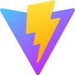

<h1 align="center">Hi there 👋, I'm Wassim</h1>
<h3 align="center">Entrepreneur | Full-Stack developer |  Cloud & DevOps Enthusiast</h3>

---

## 🚀 About Me

I'm a driven entrepreneur with a love for building and creating 🌟. I've launched two startups 🚀, crafted three Chrome extensions 🧩, and thrived as a full DevOps engineer ⚙️. Today, I’m fully immersed in full-stack development 💻, taking on exciting challenges in DevOps, CI/CD, and beyond 🌐. I’m passionate about building scalable applications 📈, diving into new technologies 🧪, and crafting elegant, efficient solutions that make a real impact 🎯.

---

## 📊 Statistics

  
  
  

## Tech stack

| 💼 Domain | 🧠 Expertise |
|:---|:---|
| ⚙️ **Backend** |           |
| 🨠**Frontend** |           |
| ☁️ **Cloud** |       |
| 🚀 **DevOps** |         |
| 🛠 **Build Tools** |     |
| 🛢️ **Databases** |         |
| 💻 **IDE** |     |
| 🧠**OS** |     |
| 📠**Scripting** |    |
| 🧪 **Testing** |    |
| 🔄 **Versioning** |     |

## 📫 Let's Connect

